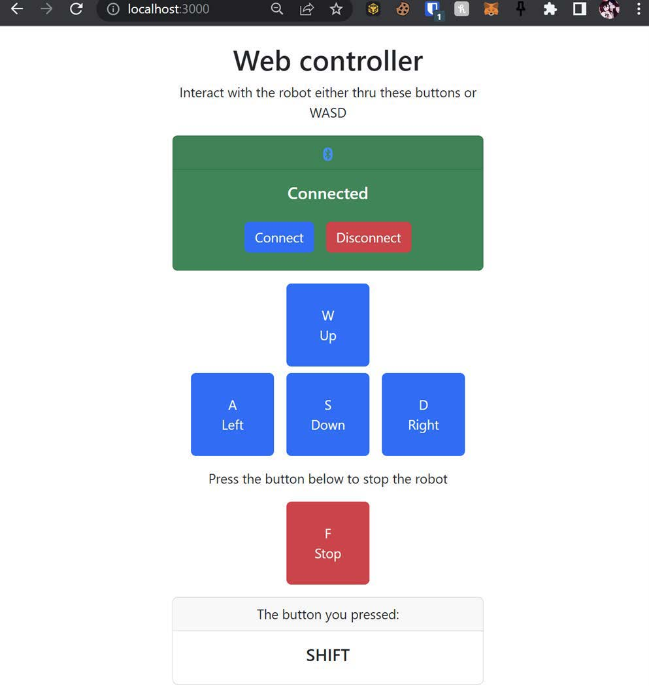
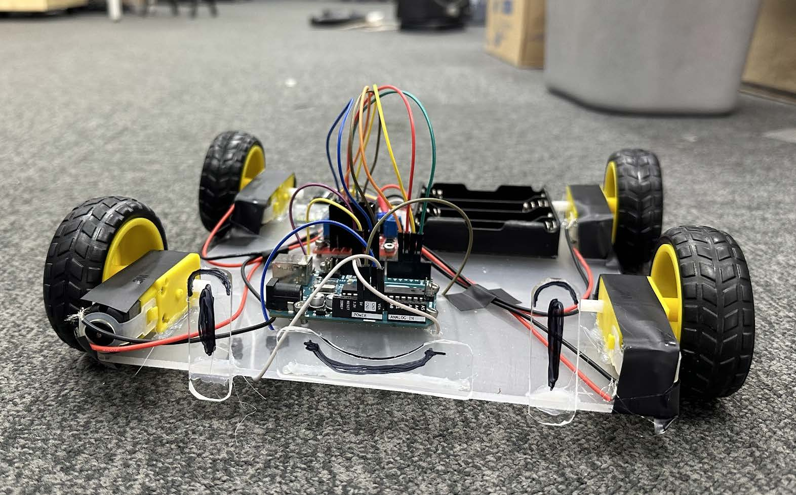
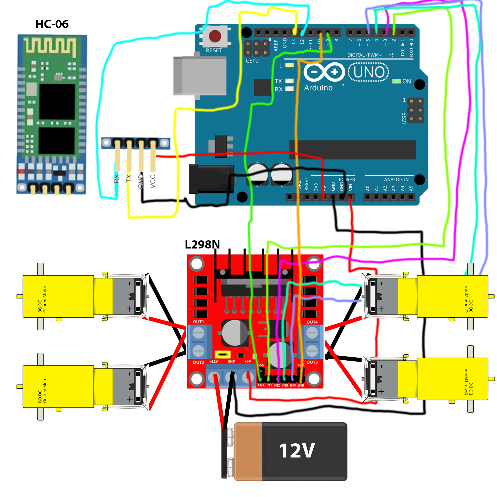

# Bluetooth RC Car with a Web Controller

This is a simple project to control a Bluetooth RC Car with a Web Controller by using NodeJS and Web Serial API.

## Screenshots of the app

## Picture of the car

## Why web serial api and not bluetooth API?
Because I am using windows, bluetooth over serial is avaliable and it's more reliable than bluetooth API. As it keeps crashing 😅

## How to use it?

0. Wire your circuit like this:

1. Download the code for the repository
2. Install the dependencies with `npm install`
3. Upload the arudino code to your arduino
4. Run the server with `node app.js`
5. Open the browser and go to `localhost:3000`

## Lastly, enjoy the app. And let me know how I can improve it, Thanks! 😄
